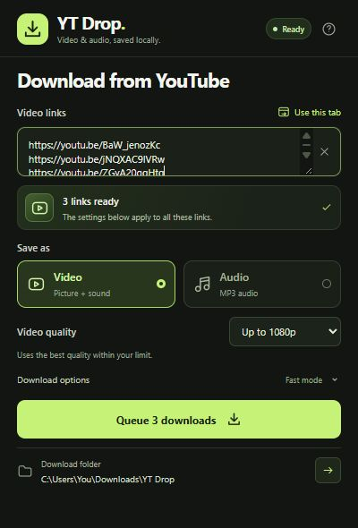
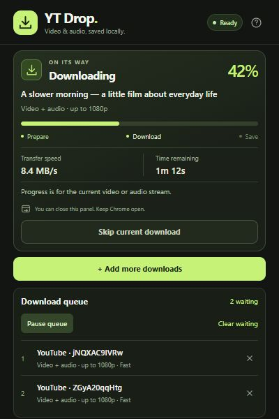

# YT Drop

A Chrome Manifest V3 extension for downloading individual YouTube videos and Shorts using [yt-dlp](https://github.com/yt-dlp/yt-dlp). Includes a Windows native messaging helper, progress, cancel, video quality caps, MP3 extraction, and session download history.

## Features

- Download the current YouTube video or paste a video / Shorts link.
- Paste multiple links and queue up to 50 waiting downloads. YT Drop downloads one item at a time, in order.
- Choose video quality up to 480p, 720p, 1080p, 4K, or best available.
- Extract high-quality MP3 audio with FFmpeg.
- See dedicated preparation, transfer, finishing, and completion screens with speed and readable time remaining.
- Use **Fast** mode (enabled by default) to fetch up to eight video fragments in parallel.
- Cancel a download, retry with its original settings, reuse recent links, and open the download folder.
- Remember format, quality, and transfer preferences immediately; keep unfinished links for the browser session.
- Get inline link validation and a built-in connection/setup guide.
- Continue downloading after closing the popup while Chrome stays open.
- Keep files on your computer through a local helper, with no hosted backend.




*UI preview with sample data.*

## New in 1.3.0: download queue

Paste one video link per line, choose the settings for that batch, and click **Queue downloads**. The first starts immediately; the rest wait in order. While it runs, use **Add more downloads** to add another batch with its own settings. Duplicate links with the same output and transfer settings are skipped while active or waiting.

- **Pause queue** lets the current item finish and holds the waiting items. **Resume queue** continues in order; it does not restart the active transfer.
- **Skip current download** cancels the active item and starts the next after it stops. When the queue is paused or empty, this button reads **Cancel download**.
- Remove a waiting item with its **×** button, or **Clear waiting** to remove all waiting items without cancelling the active download.
- Failed videos appear in history and the next item runs. If the helper disconnects, the remaining queue pauses. Reconnect, then resume; retry the interrupted item separately if needed.
- The queue stays available when the popup closes, throughout the current Chrome session. A service-worker interruption preserves waiting items but pauses them for review. **Quitting Chrome clears the session queue**, so keep Chrome running until the queue finishes.

Update both the extension and native helper for this version. The helper now releases each completed job before signalling the extension to start the next.

## New in 1.2.0

A redesigned compact popup keeps the main download controls visible, with Video/Audio cards and optional advanced settings. Progress replaces the form while a download runs. Completed jobs show the saved filename; interrupted jobs offer retry, editable options, and expandable error details. Audio mode only shows relevant audio information.

Retry now remembers Fast/Standard separately from the measured transfer speed. Downloads interrupted by a helper disconnect also appear in recent history. This update adds no extension permissions and does not change the native helper's download formats or concurrency.

## Install on Windows

Requires Chrome 105+, Python 3.10+, FFmpeg (including ffprobe), and either Node.js 22+ or Deno 2.3+. The installer checks these requirements and installs yt-dlp plus its YouTube challenge scripts into a private Python environment. No administrator rights are needed for YT Drop itself.

1. Download this repository using **Code → Download ZIP** and extract it, or clone it:

   ```powershell
   git clone https://github.com/aimen08/ytdrop.git
   cd ytdrop
   ```

2. Open PowerShell in the repository folder (the folder containing `install.ps1`) and run:

   ```powershell
   powershell -NoProfile -ExecutionPolicy Bypass -File .\install.ps1
   ```

3. Open `chrome://extensions`, turn on **Developer mode**, select **Load unpacked**, and choose the **extension folder printed by the installer**. Normally this is `%LOCALAPPDATA%\YTDrop\extension`; the printed path is authoritative if Windows redirects the installation.
4. Pin **YT Drop** from Chrome's Extensions menu. Open a YouTube video, click the extension, choose Video or Audio, then Download.

> **Select the folder containing `manifest.json`.** Do not select the repository root (`ytdrop` or `ytdrop-main`). The Chrome extension is inside `extension/`. After installing the helper, you can also load the repository's `extension/` folder directly.

Files are saved to `%USERPROFILE%\Downloads\YT Drop`. To choose a different folder, run:

```powershell
powershell -NoProfile -ExecutionPolicy Bypass -File .\install.ps1 -DownloadDirectory 'D:\Videos'
```

If prerequisites are missing, install them, then open a **new** PowerShell window and rerun setup:

```powershell
winget install --id Python.Python.3.13 -e
winget install --id Gyan.FFmpeg -e
winget install --id DenoLand.Deno -e
```

You can use an existing Node.js 22+ installation instead of Deno. Python must be available as `python.exe` on PATH.

## How it works

Chrome cannot execute yt-dlp itself. The extension's service worker connects to a registered Python helper via [Chrome native messaging](https://developer.chrome.com/docs/extensions/develop/concepts/native-messaging). The helper invokes yt-dlp with fixed argument lists, a validated YouTube video URL, and locally configured paths. There is no HTTP server or listening port. Only this extension's fixed ID is permitted to connect.

- **Video:** maximum resolution selection (480p / 720p / 1080p / 4K / best). Separate streams are merged into MKV to preserve their original codecs. A combined stream may retain its original container. A resolution cap is a maximum, not a guarantee that the source offers it.
- **Audio:** best available audio converted to MP3 using FFmpeg.
- **Progress:** shown for the current stream; it can restart when yt-dlp moves from video to audio. Merging and conversion appear as “Finishing your file,” without implying that 100% transfer means the final file is already saved.
- **Background downloads:** continue with the popup closed. Keep Chrome running. Closing Chrome, disabling the extension, or reloading it interrupts the helper. Starting the same download can resume remaining partial files.
- **One download at a time, with up to 50 waiting.** Video transfer, audio transfer, and final conversion/merging all finish before the next item starts. Cancelling terminates the yt-dlp process tree, including FFmpeg. Partial files are retained for resumption. Existing final files are not overwritten.
- **Privacy:** the extension reads the active tab when opened or when you click **Use this tab**, requests no broad website access, and stores preferences locally. Queued links, recent job details, and unfinished links are kept only for the browser session. yt-dlp contacts YouTube and its media servers; no media passes through a third-party service operated by this extension.

## Download speed

Version **1.1.0** enables **Fast** mode by default. It uses yt-dlp's [concurrent fragment downloads](https://github.com/yt-dlp/yt-dlp#download-options) to fetch up to **8 parts at once**, instead of one, for native DASH/HLS downloads. The popup remembers your choice. Choose **Standard** for one fragment at a time if Fast stalls on your connection.

This keeps the same quality selection and output formats. Direct single-file HTTP downloads do not gain parallel connections from this option; extraction, merging, and MP3 conversion also take their own time. Actual improvement depends on the video's delivery format, your connection, and YouTube's servers. Choosing a lower video resolution also reduces the amount of data to download.

A reproducible local HLS benchmark with 16 fragments and an artificial 150 ms delay per fragment measured:

| Mode | Total time including startup and processing | Fragment transfer time | Peak concurrent requests |
| --- | ---: | ---: | ---: |
| Standard | 3.98 s | 2.67 s | 1 |
| Fast | 1.49 s | 0.32 s | 8 |

The resulting files had identical SHA-256 hashes. **This is a synthetic benchmark, not a promised YouTube speedup.** See [the benchmark script](tests/benchmark_fragments.py) to reproduce it with a Python environment containing yt-dlp and FFmpeg/ffprobe plus Node.js or Deno on PATH:

```powershell
python tests/benchmark_fragments.py --output-dir "$env:TEMP\ytdrop-benchmark"
```

## Update / troubleshoot

Get the latest repository files (`git pull` or download a fresh ZIP), close Chrome, and rerun `install.ps1` to refresh the helper, extension files, and yt-dlp. Reopen Chrome; reload the unpacked extension if needed. Updates install from PyPI; yt-dlp is deliberately not pinned because YouTube changes regularly. When upgrading from 1.0.0, update both the extension and the helper for Fast mode to take effect.

- **“Manifest file is missing or unreadable”:** you selected the repository root. Use **Load unpacked** again and choose its `extension` subfolder, or the installed extension folder printed by setup. That folder must contain `manifest.json` directly.
- **Helper not found:** run setup, ensure you loaded the installed extension folder, and click Retry. If its ID differs from the ID printed by setup, restore the original manifest including its `key` field.
- **Missing FFmpeg/runtime:** rerun setup after installing the dependency. Setup records absolute executable paths so Chrome does not depend on a refreshed PATH.
- **Sign-in / bot verification / regional restrictions:** this build does not import browser cookies, authenticate, or bypass access restrictions. Some videos will be unavailable. The actual yt-dlp error appears in the popup.
- **Live broadcasts, playlists, channels:** unsupported. A live URL works once it is an archived individual video.
- **Download location:** use the folder arrow at the bottom of the popup, or **Open download folder** after completion. Downloads made by the helper do not appear in Chrome's built-in download manager.
- **Uninstall:** run `uninstall.ps1`, then remove the extension in Chrome. Downloaded files are preserved. The script prints where the remaining helper files can be removed.

Use with videos you own or have permission to download. This is an independent project, unaffiliated with YouTube or yt-dlp.

## Development and tests

No bundler or npm dependencies are required. `extension/` is directly loadable after helper setup. Do not remove the manifest's public key: it gives the unpacked extension a stable ID; no private signing key is distributed.

```text
ytdrop/
├── extension/          # Load this folder in Chrome
│   ├── manifest.json
│   ├── background.js  # Native connection and download state
│   └── popup.*        # Extension interface
├── native/host.py     # Python native messaging helper
├── tests/             # JavaScript and Python unit tests
├── docs/              # UI preview
├── install.ps1        # Per-user Windows setup
└── uninstall.ps1      # Unregister the local helper
```

```powershell
node --test tests/*.test.js
python -m unittest discover -s tests -p 'test_*.py' -v
```

The Python tests exercise native message framing, strict URL validation, command construction, progress parsing, failure handling, and cancellation. JavaScript tests exercise URL validation and service-worker behavior with a Chrome API mock. Live downloads depend on YouTube availability and are not guaranteed by the deterministic tests.

To inspect the interface without installing the helper, run `npm run preview` (or `node tests/preview-server.mjs`) and open `http://127.0.0.1:4178/popup.html`. The local preview runs the real popup and service worker with a mock Chrome API and simulated native helper. Its controls simulate progress, completion, failure, and disconnection. It performs no downloads and is not included in the extension's runtime. Reloading this development page also reloads the simulated worker, so active work is marked interrupted and waiting items pause.

See [VALIDATION.md](VALIDATION.md) for the tested behavior and remaining integration checks. The installer currently supports **Windows**; macOS and Linux installation are not included.

References: [yt-dlp README](https://github.com/yt-dlp/yt-dlp#readme), [YouTube JS runtime requirements](https://github.com/yt-dlp/yt-dlp/wiki/EJS), [native messaging protocol](https://developer.chrome.com/docs/extensions/develop/concepts/native-messaging).
