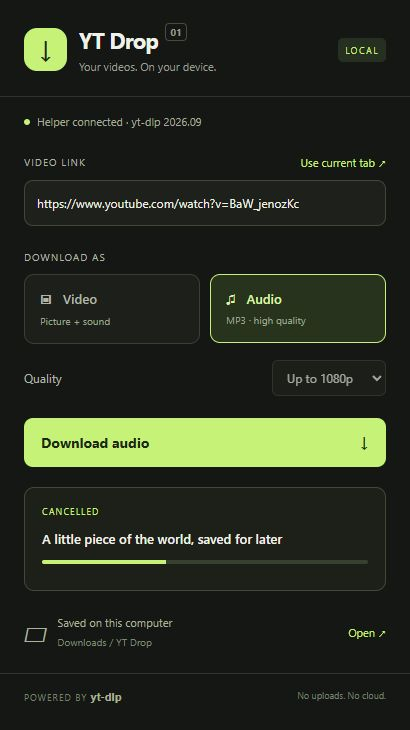

# YT Drop

A Chrome Manifest V3 extension for downloading individual YouTube videos and Shorts using [yt-dlp](https://github.com/yt-dlp/yt-dlp). Includes a Windows native messaging helper, progress, cancel, video quality caps, MP3 extraction, and session download history.

## Features

- Download the current YouTube video or paste a video / Shorts link.
- Choose video quality up to 480p, 720p, 1080p, 4K, or best available.
- Extract high-quality MP3 audio with FFmpeg.
- See download progress, speed, and estimated time remaining.
- Cancel a download, view recent jobs, and open the download folder.
- Continue downloading after closing the popup while Chrome stays open.
- Keep files on your computer through a local helper, with no hosted backend.



*UI preview with sample data.*

## Install on Windows

Requires Chrome 105+, Python 3.10+, FFmpeg (including ffprobe), and either Node.js 22+ or Deno 2.3+. The installer checks these requirements and installs yt-dlp plus its YouTube challenge scripts into a private Python environment. No administrator rights are needed for YT Drop itself.

1. Download this repository using **Code → Download ZIP** and extract it, or clone it:

   ```powershell
   git clone https://github.com/aimen08/ytdrop.git
   cd ytdrop
   ```

2. Open PowerShell in the repository folder (the folder containing `install.ps1`) and run:

   ```powershell
   powershell -NoProfile -ExecutionPolicy Bypass -File .\install.ps1
   ```

3. Open `chrome://extensions`, turn on **Developer mode**, select **Load unpacked**, and choose the **extension folder printed by the installer**. Normally this is `%LOCALAPPDATA%\YTDrop\extension`; the printed path is authoritative if Windows redirects the installation.
4. Pin **YT Drop** from Chrome's Extensions menu. Open a YouTube video, click the extension, choose Video or Audio, then Download.

> **Select the folder containing `manifest.json`.** Do not select the repository root (`ytdrop` or `ytdrop-main`). The Chrome extension is inside `extension/`. After installing the helper, you can also load the repository's `extension/` folder directly.

Files are saved to `%USERPROFILE%\Downloads\YT Drop`. To choose a different folder, run:

```powershell
powershell -NoProfile -ExecutionPolicy Bypass -File .\install.ps1 -DownloadDirectory 'D:\Videos'
```

If prerequisites are missing, install them, then open a **new** PowerShell window and rerun setup:

```powershell
winget install --id Python.Python.3.13 -e
winget install --id Gyan.FFmpeg -e
winget install --id DenoLand.Deno -e
```

You can use an existing Node.js 22+ installation instead of Deno. Python must be available as `python.exe` on PATH.

## How it works

Chrome cannot execute yt-dlp itself. The extension's service worker connects to a registered Python helper via [Chrome native messaging](https://developer.chrome.com/docs/extensions/develop/concepts/native-messaging). The helper invokes yt-dlp with fixed argument lists, a validated YouTube video URL, and locally configured paths. There is no HTTP server or listening port. Only this extension's fixed ID is permitted to connect.

- **Video:** maximum resolution selection (480p / 720p / 1080p / 4K / best). Separate streams are merged into MKV to preserve their original codecs. A combined stream may retain its original container. A resolution cap is a maximum, not a guarantee that the source offers it.
- **Audio:** best available audio converted to MP3 using FFmpeg.
- **Progress:** shown for the current stream; it can restart when yt-dlp moves from video to audio. Merging and conversion appear as “Finishing file.”
- **Background downloads:** continue with the popup closed. Keep Chrome running. Closing Chrome, disabling the extension, or reloading it interrupts the helper. Starting the same download can resume remaining partial files.
- **One download at a time.** Cancelling terminates the yt-dlp process tree, including FFmpeg. Partial files are retained for resumption. Existing final files are not overwritten.
- **Privacy:** the extension reads the current tab only when opened, requests no broad website access, and stores preferences locally. Recent job details are kept only for the browser session. yt-dlp contacts YouTube and its media servers; no media passes through a third-party service operated by this extension.

## Update / troubleshoot

Close Chrome and rerun `install.ps1` to refresh the helper, extension files, and yt-dlp. Reopen Chrome; reload the unpacked extension if needed. Updates install from PyPI; yt-dlp is deliberately not pinned because YouTube changes regularly.

- **“Manifest file is missing or unreadable”:** you selected the repository root. Use **Load unpacked** again and choose its `extension` subfolder, or the installed extension folder printed by setup. That folder must contain `manifest.json` directly.
- **Helper not found:** run setup, ensure you loaded the installed extension folder, and click Retry. If its ID differs from the ID printed by setup, restore the original manifest including its `key` field.
- **Missing FFmpeg/runtime:** rerun setup after installing the dependency. Setup records absolute executable paths so Chrome does not depend on a refreshed PATH.
- **Sign-in / bot verification / regional restrictions:** this build does not import browser cookies, authenticate, or bypass access restrictions. Some videos will be unavailable. The actual yt-dlp error appears in the popup.
- **Live broadcasts, playlists, channels:** unsupported. A live URL works once it is an archived individual video.
- **Download location:** use the Open button in the popup. Downloads made by the helper do not appear in Chrome's built-in download manager.
- **Uninstall:** run `uninstall.ps1`, then remove the extension in Chrome. Downloaded files are preserved. The script prints where the remaining helper files can be removed.

Use with videos you own or have permission to download. This is an independent project, unaffiliated with YouTube or yt-dlp.

## Development and tests

No bundler or npm dependencies are required. `extension/` is directly loadable after helper setup. Do not remove the manifest's public key: it gives the unpacked extension a stable ID; no private signing key is distributed.

```text
ytdrop/
├── extension/          # Load this folder in Chrome
│   ├── manifest.json
│   ├── background.js  # Native connection and download state
│   └── popup.*        # Extension interface
├── native/host.py     # Python native messaging helper
├── tests/             # JavaScript and Python unit tests
├── docs/              # UI preview
├── install.ps1        # Per-user Windows setup
└── uninstall.ps1      # Unregister the local helper
```

```powershell
node --test tests/*.test.js
python -m unittest discover -s tests -p 'test_*.py' -v
```

The Python tests exercise native message framing, strict URL validation, command construction, progress parsing, failure handling, and cancellation. JavaScript tests exercise URL validation and service-worker behavior with a Chrome API mock. Live downloads depend on YouTube availability and are not guaranteed by the deterministic tests.

See [VALIDATION.md](VALIDATION.md) for the tested behavior and remaining integration checks. The installer currently supports **Windows**; macOS and Linux installation are not included.

References: [yt-dlp README](https://github.com/yt-dlp/yt-dlp#readme), [YouTube JS runtime requirements](https://github.com/yt-dlp/yt-dlp/wiki/EJS), [native messaging protocol](https://developer.chrome.com/docs/extensions/develop/concepts/native-messaging).
